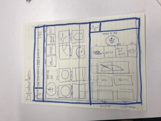
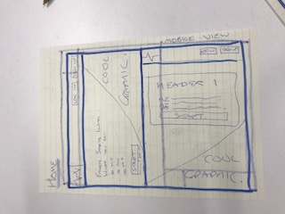
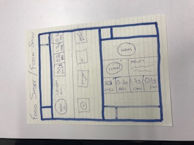

# wdi-project-4
---
# Avocardio Fitness app
---

## Project overview and motivation
Avocardio is a fitness app which tracks the calorie input and output of a user.

This was our fourth project as part of the General Assembly Web Development Immersive course. The objective was to build a full stack web application using React.

This was a group project.
---
## Contributors
* Theodora Birch
* David Comer
---
## Timeframe

1 week (December 2018)
---
## Technologies used

* React
* Javascript (ECMAScript6)
* SCSS/Css
* Bulma
* GitHub
* bcrypt
* Mongoose
* Trello
* Node.js
* Express
* Mocha
* Chai

---
## User Journey

On entering the site users can either log in or if they are a new user register for the site.


When registering the user has input the following info:
* Name
* Username
* Email
* Password
* Profile picture
* Age
* Weight
* Height
* Male/Female


This then works as the basis for the user profile page and then populates the user show.

Once they have logged in or registered users can track their daily meals, workouts on their user show page.

The Meal Show and the Workout show allows users to add meals and workout plans to their daily caloric intake and output. This then updates dynamically on the user dashboard.

---

## Approach
After we discovered a love for tracking our fitness and calorie intake for the day we decided to create a fitness app similar to My Fitness Pal.

Our back-end was complicated from the start. We have five interconnecting models:
* Exercise
```
const exerciseSchema = mongoose.Schema({
  type: String, enum: ['Jogging', 'Cycling', 'Swimming (Freestyle)'],
  intensity: { type: Number, min: 1, max: 23 },
  icon: String
});
```
* Food
```
const foodSchema = mongoose.Schema({
  name: String,
  kCalsPer100g: Number,
  proteinPer100g: Number,
  carbsPer100g: Number,
  fatPer100g: Number,
  image: String
});
```
* Meal - this referenced the User and the servings were treated as if they were comments on the Food Model.
```
const mealSchema = mongoose.Schema({
  user: {type: mongoose.Schema.ObjectId, ref: 'User'},
  date: Date,
  servings: [{
    food: {type: mongoose.Schema.ObjectId, ref: 'Food'},
    quantity: Number
  }],
  name: {
    type: String, enum: ['Breakfast', 'Lunch', 'Dinner', 'Snack']
  }
});
```
* User
```
const userSchema = mongoose.Schema({
  username: { type: String },
  email: { type: String },
  password: { type: String },
  profilePicture: String,
  forename: { type: String },
  surname: { type: String },
  age: { type: Number },
  sex: {
    type: String, enum: ['Male', 'Female']
  },
  height: { type: Number },
  weight: { type: Number },
  bodyFat: { type: Number}
});
```
* Workout - this referenced the exercise model.
```
const workoutSchema = mongoose.Schema({
  user: { type: mongoose.Schema.ObjectId, ref: 'User'},
  date: Date,
  exercise: {type: mongoose.Schema.ObjectId, ref: 'Exercise'},
  duration: { type: Number, min: 5, max: 600 }
});
```
All these models formed the basis of our back-end of the app. Once these had been established we drew wireframes. These can be seen below:






---
## Coding wins

One of the biggest coding wins that we had was creating all the virtuals that populated the user.

You can see below from the Insomnia screenshot all the information that we were able to populate on the user so we could use this on the front-end.


On the back-end we calculated base calories that a person burns based on their age, height and weight. This was done in a virtual on the back-end. The code for this can be seen below.

```
workoutSchema.virtual('baseCaloriesBurned')
  .get(function() {

    const mins = 1440;
    const weight = this.user.weight;
    const intensity = 1;

    function baseCaloriesBurned(mins, weight, intensity) {
      const calsBurned = ((intensity * weight) / 60) * mins;
      console.log('jane burned:', calsBurned);
      return calsBurned;
    }
    return baseCaloriesBurned( mins, weight, intensity);
  });
  ```

  We also pulled through the breakdown of the foods eaten in terms of the main food groups - Fats, Proteins and Carbohydrates - these were calsulated on the back-end, populated on the user and then render on the front-end.

  The code for this can be found below.
  ```
  mealSchema.virtual('totalProteins')
    .get(function() {
      return this.servings.reduce((total, serving) =>
        total + (serving.food.proteinPer100g * serving.quantity), 0);
    });

  mealSchema.virtual('totalCarbs')
    .get(function() {
      return this.servings.reduce((total, serving) =>
        total + (serving.food.carbsPer100g * serving.quantity), 0);
    });

  mealSchema.virtual('totalFats')
    .get(function() {
      return this.servings.reduce((total, serving) =>
        total + (serving.food.fatPer100g * serving.quantity), 0);
    });
```
---
## Challenges

By far the biggest challenge that we had on this project was being too ambitious. We created a mammoth task for ourselves by creating a back-end that was vastly complicated and did not gage how much time it was realistically going to take us to complete the project. As a result, we spent 80% of our time perfecting the back-end of the app and therefore the front-end was less developed.

## Wins

A huge win for us was getting all the virtuals and models to interlink on the back-end.
---

## Future features

If we had more time we would have developed the front-end better by using chart.js to display the data. We would also use an external API to pull the caloric information of food that is uploaded.
">

When registering the user has input the following info:
* Name
* Username
* Email
* Password
* Profile picture
* Age
* Weight
* Height
* Male/Female


This then works as the basis for the user profile page and then populates the user show.

Once they have logged in or registered users can track their daily meals, workouts on their user show page.

The Meal Show and the Workout show allows users to add meals and workout plans to their daily caloric intake and output. This then updates dynamically on the user dashboard.

---

## Approach
After we discovered a love for tracking our fitness and calorie intake for the day we decided to create a fitness app similar to My Fitness Pal.

Our back-end was complicated from the start. We have five interconnecting models:
* Exercise
```
const exerciseSchema = mongoose.Schema({
  type: String, enum: ['Jogging', 'Cycling', 'Swimming (Freestyle)'],
  intensity: { type: Number, min: 1, max: 23 },
  icon: String
});
```
* Food
```
const foodSchema = mongoose.Schema({
  name: String,
  kCalsPer100g: Number,
  proteinPer100g: Number,
  carbsPer100g: Number,
  fatPer100g: Number,
  image: String
});
```
* Meal - this referenced the User and the servings were treated as if they were comments on the Food Model.
```
const mealSchema = mongoose.Schema({
  user: {type: mongoose.Schema.ObjectId, ref: 'User'},
  date: Date,
  servings: [{
    food: {type: mongoose.Schema.ObjectId, ref: 'Food'},
    quantity: Number
  }],
  name: {
    type: String, enum: ['Breakfast', 'Lunch', 'Dinner', 'Snack']
  }
});
```
* User
```
const userSchema = mongoose.Schema({
  username: { type: String },
  email: { type: String },
  password: { type: String },
  profilePicture: String,
  forename: { type: String },
  surname: { type: String },
  age: { type: Number },
  sex: {
    type: String, enum: ['Male', 'Female']
  },
  height: { type: Number },
  weight: { type: Number },
  bodyFat: { type: Number}
});
```
* Workout - this referenced the exercise model.
```
const workoutSchema = mongoose.Schema({
  user: { type: mongoose.Schema.ObjectId, ref: 'User'},
  date: Date,
  exercise: {type: mongoose.Schema.ObjectId, ref: 'Exercise'},
  duration: { type: Number, min: 5, max: 600 }
});
```
All these models formed the basis of our back-end of the app. Once these had been established we drew wireframes. These can be seen below:


---
## Coding wins

One of the biggest coding wins that we had was creating all the virtuals that populated the user.

You can see below from the Insomnia screenshot all the information that we were able to populate on the user so we could use this on the front-end.


On the back-end we calculated base calories that a person burns based on their age, height and weight. This was done in a virtual on the back-end. The code for this can be seen below.

```
workoutSchema.virtual('baseCaloriesBurned')
  .get(function() {

    const mins = 1440;
    const weight = this.user.weight;
    const intensity = 1;

    function baseCaloriesBurned(mins, weight, intensity) {
      const calsBurned = ((intensity * weight) / 60) * mins;
      console.log('jane burned:', calsBurned);
      return calsBurned;
    }
    return baseCaloriesBurned( mins, weight, intensity);
  });
  ```

  We also pulled through the breakdown of the foods eaten in terms of the main food groups - Fats, Proteins and Carbohydrates - these were calsulated on the back-end, populated on the user and then render on the front-end.

  The code for this can be found below.
  ```
  mealSchema.virtual('totalProteins')
    .get(function() {
      return this.servings.reduce((total, serving) =>
        total + (serving.food.proteinPer100g * serving.quantity), 0);
    });

  mealSchema.virtual('totalCarbs')
    .get(function() {
      return this.servings.reduce((total, serving) =>
        total + (serving.food.carbsPer100g * serving.quantity), 0);
    });

  mealSchema.virtual('totalFats')
    .get(function() {
      return this.servings.reduce((total, serving) =>
        total + (serving.food.fatPer100g * serving.quantity), 0);
    });
```
---
## Challenges

By far the biggest challenge that we had on this project was being too ambitious. We created a mammoth task for ourselves by creating a back-end that was vastly complicated and did not gage how much time it was realistically going to take us to complete the project. As a result, we spent 80% of our time perfecting the back-end of the app and therefore the front-end was less developed.

## Wins

A huge win for us was getting all the virtuals and models to interlink on the back-end.
---

## Future features

If we had more time we would have developed the front-end better by using chart.js to display the data. We would also use an external API to pull the caloric information of food that is uploaded.
